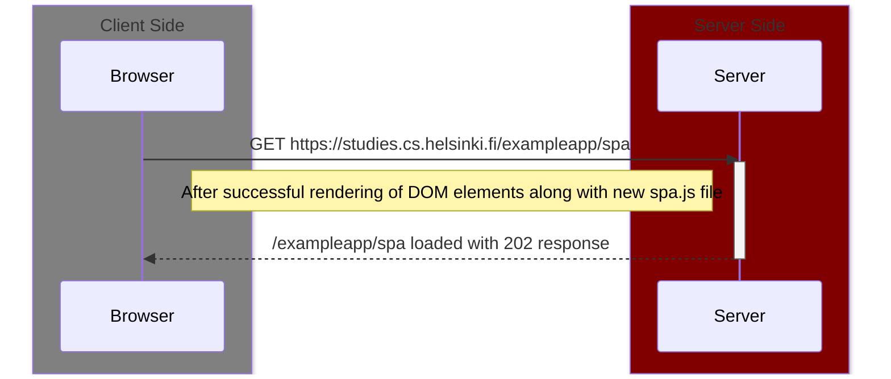

```mermaid
sequenceDiagram
box grey Client Side
participant Browser
end
box Maroon Server Side
participant Server
end

Browser->>Server: GET https://studies.cs.helsinki.fi/exampleapp/spa
activate Server
note left of Server: After successful rendering of DOM elements along with new spa.js file
Server-->>Browser: /exampleapp/spa loaded with 202 response
deactivate Server
```
    
